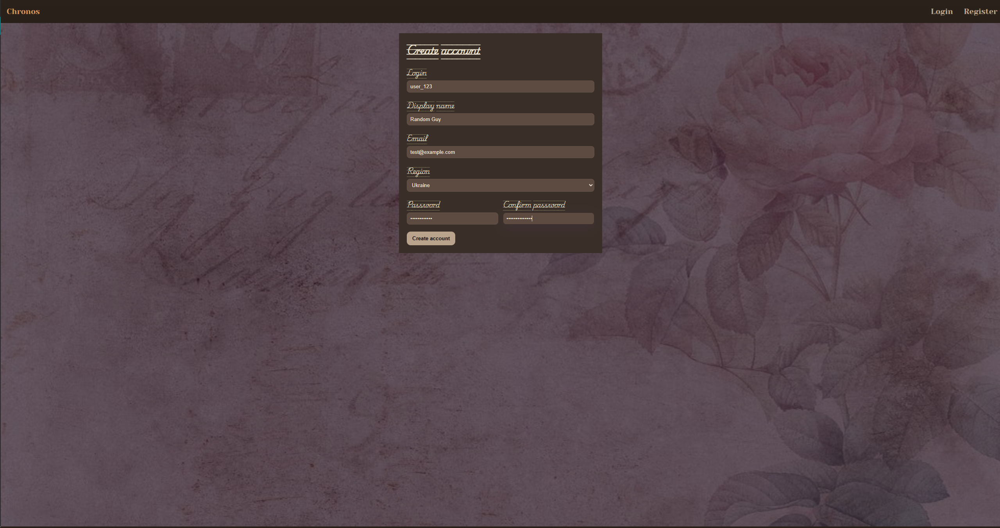
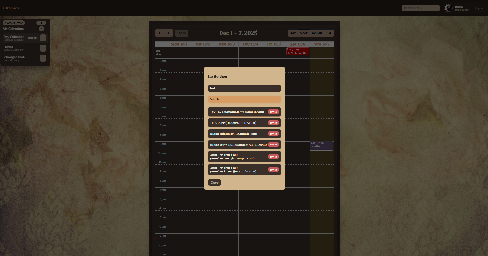

# Chronos

Chronos is a fullstack event calendar application that provides useful tools for managing calendars, sharing them with others, and keeping track of tasks, arrangements, and reminders with ease.

## Table of Contents

- [Features](#features)
- [Technical Stack](#technical-stack)
- [Getting Started](#getting-started)
- [Project Structure](#project-structure)
- [Screenshots](#screenshots)
- [Documentation](#documentation)
- [Author](#author)
- [License](#license)

## Features

- **User Authentication** - Registration, login, email confirmation, password reset
- **Calendar Management** - Create, edit, delete and share your calendars with others
- **Event Types** - Support for arrangements, tasks, and reminders
- **Repeating Events** - Set events to repeat daily, weekly, or monthly
- **Email Notifications** - Automatic reminders sent 10 minutes before events
- **User Profiles** - Customizable avatars and user information
- **Regional Calendars** - Automatic public holidays calendar based on your region
- **Event Search** - Quick search across all your events
- **Calendar Sharing** - Collaborate by sharing calendars with other users

## Technical Stack

### Backend

- **Node.js** - JavaScript runtime environment
- **Express.js** - Web application framework
- **MongoDB Atlas** - Cloud-hosted NoSQL database
- **Mongoose** - MongoDB object modeling library
- **bcrypt** - Password hashing and security
- **express-session** - Session management middleware
- **nodemailer** - Email notifications system
- **node-cron** - Task scheduling for reminders
- **multer** - File upload handling
- **Google Calendar API** - Public holidays integration

### Frontend

- **React 18** - Modern UI library
- **React Router DOM** - Client-side routing
- **Axios** - HTTP client for API calls
- **Vite** - Fast build tool and dev server
- **FullCalendar** - Interactive calendar component
- **React Hook Form** - Form state management
- **Yup** - Schema validation for forms

### DevOps

- **Docker** - Application containerization
- **Docker Compose** - Multi-container orchestration
- **Nginx** - Reverse proxy (planned)

## Getting Started

### Prerequisites

Before you begin, ensure you have the following installed:
- **Node.js v18+** and **npm**
- **MongoDB Atlas account** (for database)
- **Gmail account** (for email notifications)
- **Google API Key** (for regional calendars)

### Environment Configuration

#### Backend Setup

1. Navigate to the backend directory:
```bash
cd backend
```

2. Create a `.env` file with the following variables:
```env
# Server Configuration
PORT=3000
HOST=localhost
NODE_ENV=development

# Database
MONGO_URI=your_mongodb_atlas_connection_string

# Session
SESSION_SECRET=your_random_secret_key_here

# Email Service (Gmail)
EMAIL_USER=your_gmail@gmail.com
EMAIL_PASS=your_gmail_app_password
HOST_FOR_EMAIL=localhost
PORT_FOR_EMAIL=3000

# Frontend Configuration
FRONTEND_PROTOCOL=http
FRONTEND_HOST=localhost
FRONTEND_PORT=3001

# Google Calendar API
GOOGLE_API_KEY=your_google_api_key_here
```

**Important Notes:**

- Get your MongoDB connection string from [MongoDB Atlas](https://www.mongodb.com/cloud/atlas)
- Use Gmail App Password (not your regular password) - [Guide](https://support.google.com/accounts/answer/185833)
- Generate SESSION_SECRET with: `openssl rand -base64 32`
- Get Google API Key from [Google Cloud Console](https://console.cloud.google.com/)

#### Frontend Setup

1. Navigate to the frontend directory:
```bash
cd frontend
```

2. The `.env` file should contain:
```env
VITE_API_URL=/api
```

### Installation

#### Manual Setup (Development)

1. **Clone the repository:**
```bash
git clone https://github.com/Butterfly2112/Chronos.git
cd Chronos
```

2. **Install backend dependencies:**
```bash
cd backend
npm install
```

3. **Install frontend dependencies:**
```bash
cd ../frontend
npm install
```

4. **Start the backend server:**
```bash
cd backend
npm start
# Server will run on http://localhost:3000
```

5. **Start the frontend (in a new terminal):**
```bash
cd frontend
npm run dev
# Frontend will run on http://localhost:3001
```

6. **Open your browser:**
   Navigate to `http://localhost:3001`

#### Docker Setup (Coming Soon)

Docker configuration is currently in development. When ready, you'll be able to run the entire application with:
```bash
docker-compose up
```

This will start both frontend and backend services automatically.
## Project Structure
```
chronos/
├── backend/                # Node.js + Express backend
│   ├── config/             # Database and session configuration
│   ├── controllers/        # Request handlers
│   ├── models/             # Mongoose schemas
│   ├── routes/             # API endpoints
│   ├── services/           # Business logic
│   ├── middleware/         # Authentication and validation
│   └── utils/              # Helper functions
│
├── frontend/               # React frontend
│   ├── src/
│   │   ├── components/    # Reusable UI components
│   │   ├── contexts/      # React contexts
│   │   ├── pages/         # Page components
│   │   ├── services/      # API client
│   │   └── styles/        # CSS files
│   └── public/            # Static assets
│
└── docker-compose.yml     # Docker configuration (in development)
```
## Screenshots





## Documentation
- [Beckend Documentation](backend/README.md)
- [Frontend Documentation](frontend/README.md)
## Author

This is an educational team project for Innovation Campus NTU "KhPI", FullStack Track Challenge.

### Team Members
- **Anastasiia Shyrkova**
- **Diana Malashta**
- **Kateryna Lytovchenko**

## License

This project is developed for educational purposes at NTU "KhPI".
